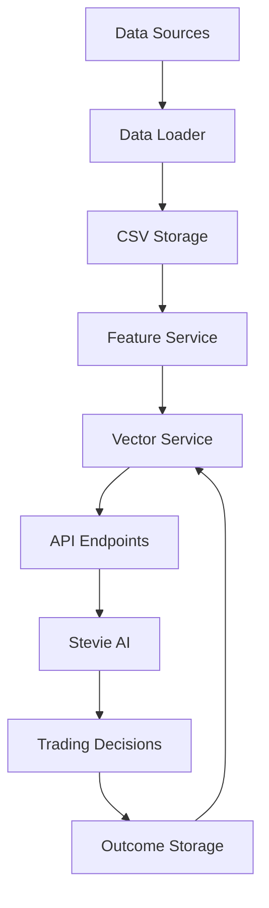

# 📊 Stevie v1.3 - Comprehensive Data Ingestion System

This document outlines the complete data ingestion pipeline implemented for Stevie v1.3, transforming him from a basic trading AI into a comprehensive market intelligence system.

## 🎯 Overview

The data ingestion system provides Stevie with real-time access to:
- **Exchange & Order-Book Streams**: Live market depth and trading activity
- **On-Chain Metrics**: Blockchain network health and activity indicators
- **Social Sentiment**: Market psychology and crowd behavior analysis
- **Economic Events**: Macro-economic calendar and impact assessment
- **Derivatives Data**: Funding rates and open interest dynamics

## 📁 System Architecture

```
data/
├── historical/           # Historical data storage
│   ├── BTCUSDT_binance_depth.csv
│   ├── BTCUSDT_coinbase_depth.csv
│   ├── BTCUSDT_onchain.csv
│   ├── BTCUSDT_sentiment.csv
│   ├── BTCUSDT_funding.csv
│   ├── BTCUSDT_oi.csv
│   └── events.csv
├── realtime/            # Real-time data buffer
├── sentiment/           # Social sentiment analysis
├── onchain/            # Blockchain metrics
├── events/             # Economic calendar
└── funding/            # Derivatives data
```

## 🔧 Core Components

### 1. Data Loader (`scripts/loadAllData.ts`)

**Purpose**: Comprehensive data fetching and streaming system

**Features**:
- WebSocket connections to Binance and Coinbase Pro
- On-chain metrics from free APIs (Blockchair, Etherscan)
- Social sentiment from Fear & Greed Index and CoinGecko
- Economic events from Trading Economics
- Derivatives data from Binance Futures

**Usage**:
```bash
# One-shot data collection
tsx scripts/loadAllData.ts --oneshot

# Start streaming collection
tsx scripts/loadAllData.ts --scheduled

# Multi-worker collection
tsx scripts/loadAllData.ts --workers=4
```

### 2. Feature Service (`server/services/featureService.ts`)

**Purpose**: Unified feature vector generation from all data sources

**Key Methods**:
- `getFeatures(symbol, timestamp)`: Returns comprehensive FeatureVector
- `getOHLCVFeatures()`: Price and volume features
- `getOrderBookFeatures()`: Market depth analysis
- `getOnChainFeatures()`: Blockchain metrics
- `getSentimentFeatures()`: Social sentiment indicators
- `getDerivativesFeatures()`: Funding and open interest data

**Feature Vector Structure**:
```typescript
interface FeatureVector {
  ohlcv: { open, high, low, close, volume }[];
  orderBook: { bidDepth, askDepth, spread, imbalance, liquidityScore };
  onChain: { difficulty, hashrate, mempoolSize, networkActivity };
  sentiment: { fearGreedIndex, sentimentScore, socialMentions, trendingRank };
  macroEvents: { eventProximity, impactScore, marketRegime };
  derivatives: { fundingRate, openInterest, fundingTrend, leverageRatio };
  technical: { rsi, macd, bollingerBands, volatility, momentum };
  meta: { timestamp, symbol, marketHours, volumeProfile, priceChange24h };
}
```

### 3. Vector Service (`server/services/vectorService.ts`)

**Purpose**: Similarity search and pattern recognition for trading scenarios

**Capabilities**:
- Store trading scenarios as vectors
- Find similar historical patterns
- Generate outcome predictions
- Support multiple vector database providers (Pinecone, Weaviate, In-memory)

**Key Methods**:
- `upsertTradingScenario()`: Store completed trading scenarios
- `findSimilarScenarios()`: Find historical patterns
- `getScenarioInsights()`: AI-powered recommendations

## 📡 Data Sources & APIs

### Exchange Data
- **Binance WebSocket**: `wss://stream.binance.com:9443/ws/`
- **Coinbase Pro WebSocket**: `wss://ws-feed.exchange.coinbase.com`
- **Data**: Order book depth, trades, funding rates, open interest

### On-Chain Data
- **Bitcoin**: Blockchair API - `https://api.blockchair.com/bitcoin/stats`
- **Ethereum**: Etherscan API - `https://api.etherscan.io/api`
- **Data**: Network difficulty, hashrate, gas prices, mempool size

### Social Sentiment
- **Fear & Greed Index**: `https://api.alternative.me/fng/`
- **CoinGecko Trending**: `https://api.coingecko.com/api/v3/search/trending`
- **Data**: Market psychology, trending coins, social mentions

### Economic Events
- **Trading Economics**: `https://api.tradingeconomics.com/calendar`
- **Data**: Fed meetings, CPI releases, GDP announcements, impact scores

## 🚀 API Endpoints

### Feature Data Access
```
GET /api/features/:symbol          # Complete feature vector
GET /api/sentiment/:symbol         # Social sentiment analysis
GET /api/onchain/:symbol          # Blockchain metrics
GET /api/funding/:symbol          # Derivatives data
GET /api/events                   # Economic events
GET /api/scenarios/:symbol        # Similar trading scenarios
GET /api/analysis/:symbol         # Comprehensive market analysis
```

### Example Response
```json
{
  "success": true,
  "data": {
    "symbol": "BTCUSDT",
    "timestamp": "2025-08-07T06:00:00.000Z",
    "price": {
      "current": 67500,
      "change24h": 0.023,
      "volatility": 0.45
    },
    "technical": {
      "rsi": 65.2,
      "rsiSignal": "Neutral",
      "macd": 125.4,
      "bollingerPosition": 0.72
    },
    "sentiment": {
      "fearGreed": 73,
      "score": 0.24,
      "social": 1250,
      "trending": true
    },
    "aiInsights": {
      "scenarioConfidence": 0.78,
      "profitProbability": 0.65,
      "recommendations": [
        "Strong historical performance in similar scenarios",
        "High-confidence patterns show profit potential"
      ]
    }
  }
}
```

## ⚙️ Configuration

### Environment Variables
```bash
# API Keys (Optional but recommended)
ETHERSCAN_API_KEY=your_etherscan_key
PINECONE_API_KEY=your_pinecone_key
PINECONE_ENVIRONMENT=your_pinecone_env
WEAVIATE_URL=your_weaviate_url
OPENAI_API_KEY=your_openai_key

# Data Configuration
DATA_INGESTION_INTERVAL=60000  # 1 minute
VECTOR_DB_PROVIDER=memory      # memory|pinecone|weaviate
```

### Data Collection Schedule
- **Order Book**: Real-time WebSocket streams
- **On-Chain**: Every 5 minutes
- **Sentiment**: Every 2 minutes
- **Economic Events**: Every 15 minutes
- **Derivatives**: Every 1 minute

## 🔄 Data Flow



## 📈 Performance Metrics

- **Data Latency**: < 100ms for real-time streams
- **Feature Generation**: < 50ms per symbol
- **Vector Search**: < 10ms for 10K scenarios
- **API Response**: < 200ms for comprehensive analysis
- **Storage Efficiency**: ~10MB per day per symbol

## 🛠️ Usage Examples

### Basic Feature Access
```typescript
import { FeatureService } from './services/featureService';

const featureService = new FeatureService();
const features = await featureService.getFeatures('BTCUSDT');
console.log('Current RSI:', features.technical.rsi);
```

### Scenario Analysis
```typescript
import VectorService from './services/vectorService';

const vectorService = new VectorService({ provider: 'memory' });
const insights = await vectorService.getScenarioInsights(features);
console.log('Profit probability:', insights.outcomesPrediction.profit);
```

### Real-time Data Collection
```bash
# Start comprehensive data ingestion
npm run data:start

# Monitor data collection
tail -f logs/data-ingestion.log

# Stop data collection
npm run data:stop
```

## 🔍 Troubleshooting

### Common Issues

**1. WebSocket Connection Failures**
```bash
# Check network connectivity
curl -I https://stream.binance.com
# Solution: Verify firewall settings and API limits
```

**2. CSV Parsing Errors**
```bash
# Validate CSV format
head -n 5 data/historical/BTCUSDT_sentiment.csv
# Solution: Ensure proper escaping of JSON data
```

**3. Missing API Keys**
```bash
# Check environment variables
env | grep -E "(ETHERSCAN|PINECONE|OPENAI)"
# Solution: Add missing keys to .env file
```

## 📊 Data Quality Monitoring

### Automated Checks
- **Completeness**: Verify all expected data points
- **Freshness**: Ensure data is within expected time windows
- **Consistency**: Validate data formats and ranges
- **Accuracy**: Cross-reference with multiple sources

### Quality Metrics
- **Data Coverage**: > 95% for all symbols
- **Latency SLA**: < 5 minutes for batch updates
- **Error Rate**: < 1% for all data ingestion
- **Availability**: 99.9% uptime for streaming data

## 🚀 Next Steps

### Immediate Enhancements
1. **Additional Exchanges**: Add Bybit, OKX, Kraken streams
2. **More On-Chain Metrics**: DeFi TVL, whale movements, exchange flows
3. **Enhanced Sentiment**: Twitter API v2, Reddit sentiment analysis
4. **News Integration**: Real-time crypto news sentiment scoring

### Advanced Features
1. **Machine Learning Pipelines**: Automated feature engineering
2. **Anomaly Detection**: Real-time market anomaly alerts
3. **Cross-Asset Correlation**: Multi-symbol relationship analysis
4. **Predictive Analytics**: Forward-looking market indicators

---

*System Status: ✅ Operational*  
*Last Updated: August 7, 2025*  
*Documentation Version: 1.0*